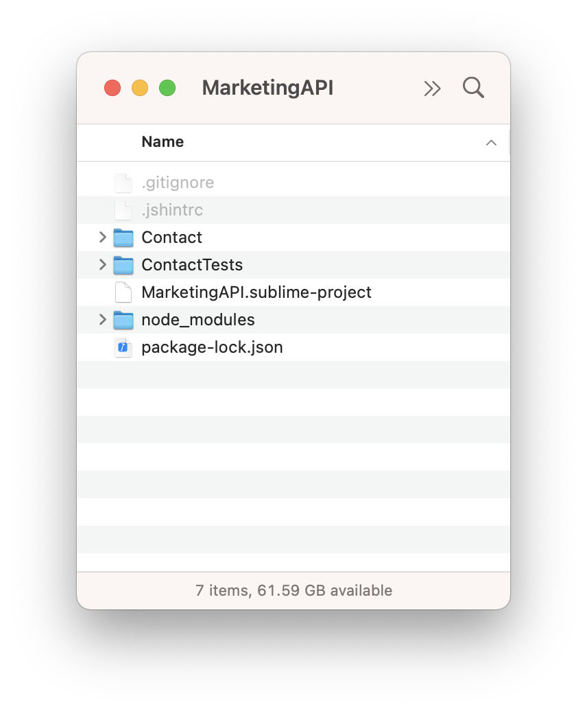
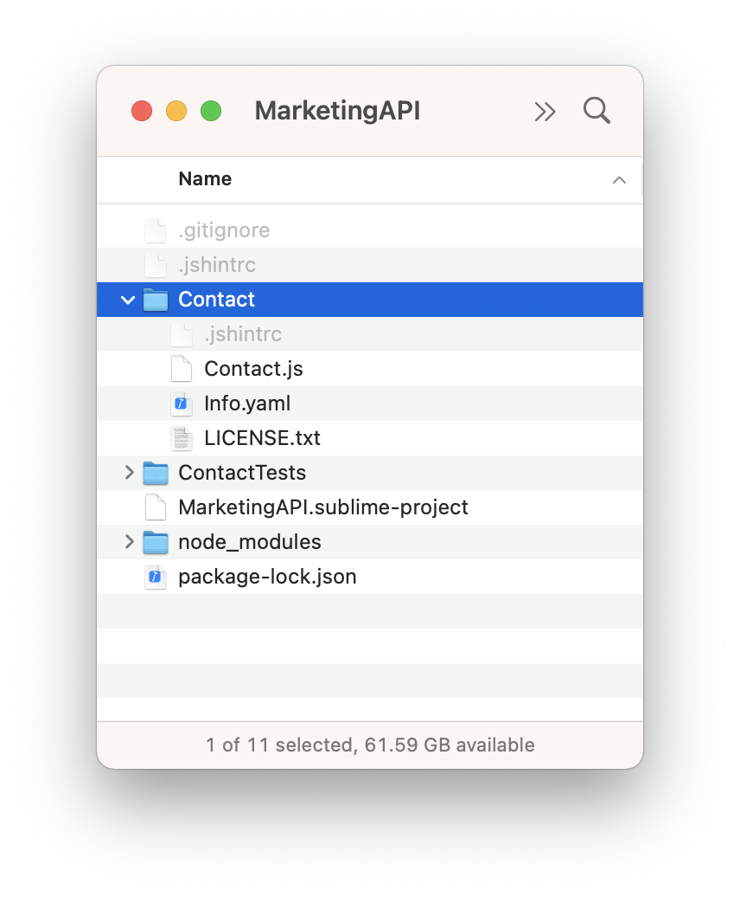

Creating an APIKit project for AWS Lambda
====

*Throughout this document, we'll use the example of a Conctact endpoint for a
marketing site's API.*

The first step is to create a workspace for your api's various
projects.  Typically an API will have multiple endpoints/URLs.  Each endpoint
is its own `APIKit` project.

````
$ cd ~/Documents
$ mkdir MarketingAPI
$ cd MarketingAPI
$ npm install --save-dev @breakside/jskit
$ npx jskit init
````

With the workspace initialized, you can add a project for our first endpoint. 
Note that we're creating an `api`(jskit.add.api) project, which will result in a
node-based `APIKit` project:
````
$ npx jskit add api Contact
````

To add more endpoints, simply use `jskit add`(jskit.add) again.

Workspace Organization
========

At this point, your workspace includes a few folders and files:



- `package-lock.json` and `node_modules/` are created by `npm install` and are
  related to how node.js manages installed modules.
- `.gitignore` is created by `jskit init` with defaults for items that should
  be ignored by `git`
- `.jshintrc` is created by `jskit init` to include javascript settings for your
  application.
- `MarketingAPI.sublime-project` is created by `jskit init` to provide a project
  organization for the SublimeText editor
- `Contact/` is your `APIKit` based project
- `ContactTests/` is your `TestKit` based project, automatically created by
  `jskit add`

The files you'll be most intersted in editing are inside the `Contact/`
and `ContactTests/` folders, the two projects in the workspace.

Project Organization
===========

Each project created by `jskit add` comes from a template that includes
a few basic things to get the project going.

Taking a look inside the `Contact/` project, we see



- `Info.yaml` contains api properties that define how the api handler starts up
- `Contact.js` defines the main `APIResponder` subclass that will handle requests
- `LICENSE.txt` contains the license for your code

Info File
---------

The `Info.yaml` is a collection of properties:

````
JSBundleType: api
JSBundleIdentifier: com.yourcompany.Contact
JSBundleVersion: 1.0.0
APIResponder: Contact
JSDevelopmentLangauge: en
````

The details of the Info file are specified in [APIKit Info](APIKitInfo), but the important property
for our purposes here is the `APIResponder` property, which tells the api handler
to instantiate a class named `Contact` on startup.

Responder
--------------------

`Contact.js` contains the code for a class that defines a subclass of
`APIResponder`:

````
// #import APIKit
'use strict';

JSClass("Contact", APIResponder, {

    get: async function(){
        return {
            message: "Hello, world!"
        };
    }

});
````

Every api project requires a single responder to take over after the
api's handler's initialization code has run.

In this case, when the api initialization code runs, it creates a `Contact`
responder.

The responder is where you can process an `APIRequest` and generate a response.

Node modules
------------
Since an `APIKit` project runs on node.js, you're allowed to install
any node module you'd like by creating a `package.json` file in the project
and adding dependencies.

Here's how it would look if we needed `redis`:

**MarketingAPI/Contact/package.json**
````
{
  "name": "Contact",
  "private": true,
  "dependencies": {
    "redis": "^2.8.0"
  }
}
````

Use the node dependencies by calling `require()` in any `.js` file in your
project just as you normally would.

The dependencies will be built into the package submitted to the API provider.

Localization with .lproj folders
---------

If an api only serves data, it has little need for localization.

However, should you need to provide localized strings in different languages
to different users, you can add `.lproj` folders.

Every `APIKit` project can contain `.lproj` folders.  By default,
none are created.

The folders are named after their language codes.  For example, an English
folder would be named `en.lproj`.

Inside `en.lproj` are `.strings.yaml` files that define a mapping of keys to
values.

Each file in `en.lproj` is considered a table.  When you make a call to
`JSBundle.localizedString()`, it looks for a table named `Localizable` by
default.

Here's what `en.lproj/Localizable.strings.yaml` would look like:
````
en:
  helloWorld: Hello, world!
````

To add other lauguages, simply copy an existing `.lproj` folder and update the
string tables.

For example, if you wanted to make a spanish translation availble, you'd
1. Copy `en.lproj` to `es.lproj` (`es` for Español).
2. Edit each string table file to start with a top level `es` key instead of
   `en`
3. Change the strings for each key to spanish.


Here's what `es.lproj/Localizable.strings.yaml` would look like:
````
es:
  helloWorld: ¡Hola Mundo!
````

Images, Fonts, and Other Resources
=====
Easily referencing images, fonts, and other files from within an api's
code requires that those files be considered "resources" by the build sytem.

In an api app, pretty much anything that's not a `.js` file in the project folder
or subfolders is considered a resource.

So, you can create whatever subfolder structure you want, putting code and
resources in any place, and the build system will find them.

*Note: resources are referenced by their filename regardless of which subfolder
they are in.  Therefore, you should avoid giving two resources the same filename
even if they are in different subfolders*

Resources are bundled in the application in a special way that includes their
metadata (like file sizes, mime types, and image resolutions).

See `JSBundle` for more information about resources.