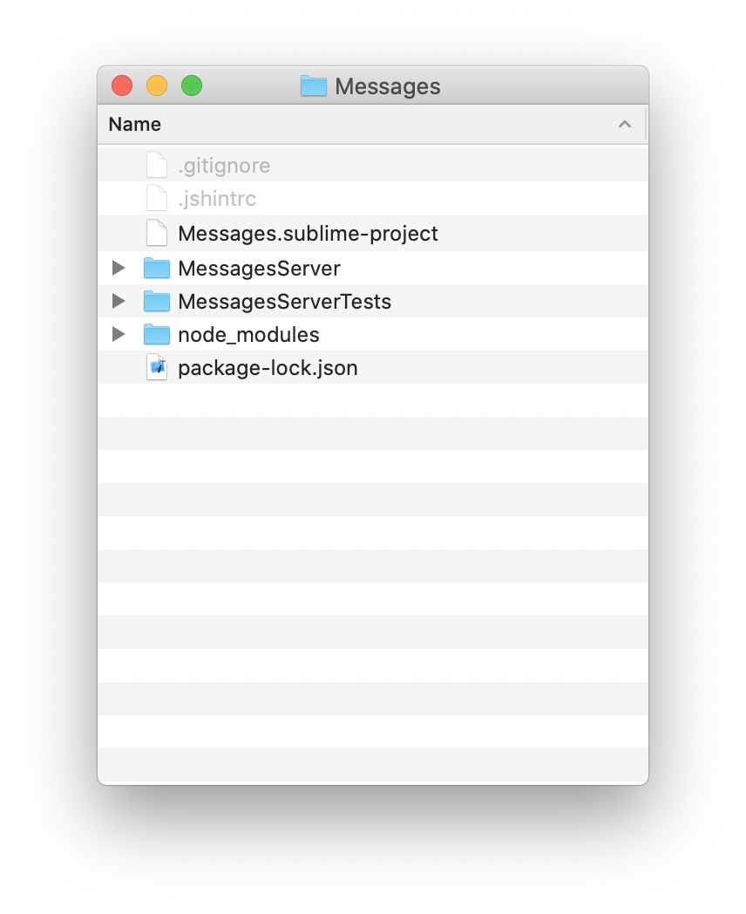
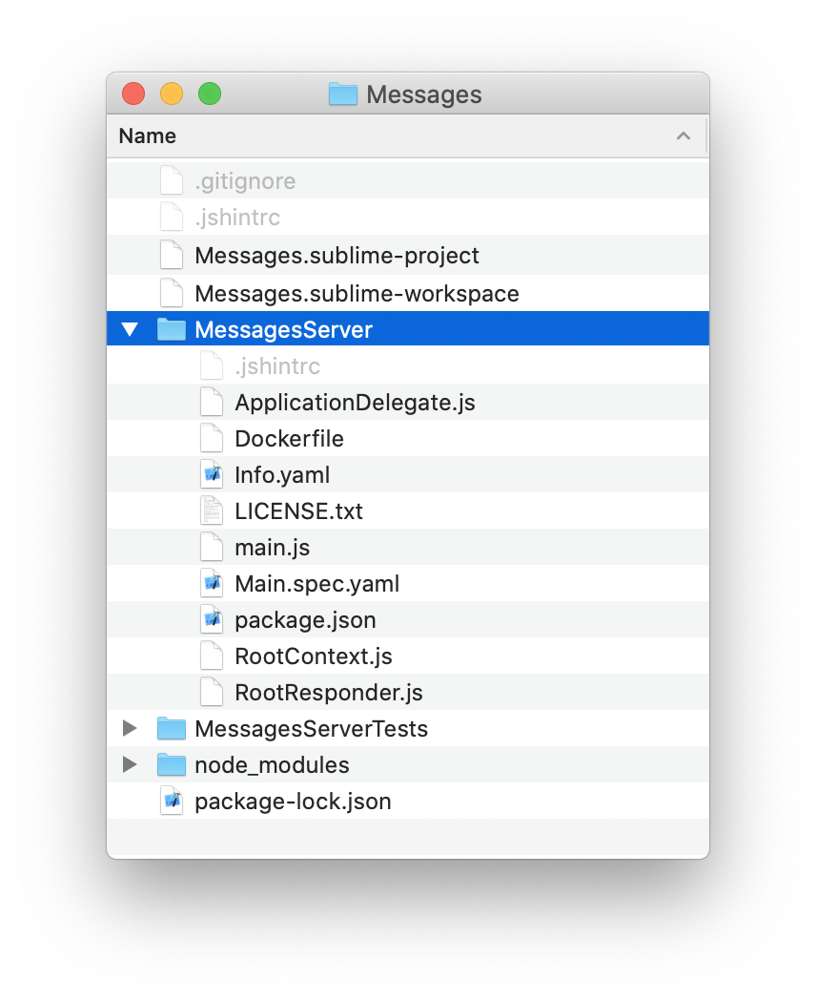

Creating a Node-based SKApplication
====

*Throughout this document, we'll use the example of a Messages application.*

Using the `jskit` command line utilty, a server-based application is created
with the `jskit add`(jskit.add) subcommand.

The first step is to create a workspace for your application's various
projects.  Even this simplest server application has two projects: the `ServerKit`
app itself and a companion `TestKit` project.
````
$ cd ~/Documents
$ mkdir Messages
$ cd Messages
$ npm install --save-dev jskit
$ npx jskit init
````

With the workspace initialized, you can add a project.  Note that
we're creating an `http`(jskit.add.http) project, which will result in a
server-based `ServerKit` project:
````
$ npx jskit add http MessagesServer
````

Workspace Organization
========

At this point, your workspace includes a few folders and files:



- `package-lock.json` and `node_modules/` are created by `npm install` and are
  related to how node.js manages installed modules.
- `.gitignore` is created by `jskit init` with defaults for items that should
  be ignored by `git`
- `.jshintrc` is created by `jskit init` to include a list of globals that
  are availble to `JSKit` based projects
- `Messages.sublime-project` is created by `jskit init` to provide a project
  organization for the SublimeText editor
- `MessagesServer/` is your `ServerKit` based project
- `MessagesServerTests/` is your `TestKit` based project, automatically created by
  `jskit add`

The files you'll be most intersted in editing are inside the `MessagesServer/`
and `MessagesServerTests/` folders, the two projects in the workspace.

Project Organization
===========

Each project created by `jskit add` comes from a template that includes
a few basic things to get the project going.

Taking a look inside the `MessagesServer/` project, we see



- `Info.yaml` contains application properties that define how the app starts up
- `Main.spec.yaml` is a spec file that sketches out the server components and
  defines the URL paths, or routes, the server handles
- `ApplicationDelegate.js` handles tasks when the application launches
- `RootResponder.js` defines the class that handles requests to the `"/"` URL path
- `RootContext.js` defines the context class used by `RootResponder`()
- `package.json` can be used to add node module dependencies
- `Dockerfile` defines how to package the app
- `LICENSE.txt` contains the license for your code

Info File
---------

The `Info.yaml` is a collection of properties:

````
JSBundleType: node
JSBundleIdentifier: com.yourcompany.MessagesServer
JSBundleVersion: 1.0.0
JSExecutableName: MessagesServer
JSDevelopmentLangauge: en
SKMainSpec: Main
SKApplicationLaunchOptions:
    port: {kind: integer, default: 8081}
````

The details of the Info file are specified in [SKApplication Info](SKApplicationInfo), but the important property
for our purposes here is the `SKMainSpec` property, which tells the application
to load a spec file named `Main` on startup.

*Note: when referencing a spec file in an `Info` file, the `.spec.yaml` file
extensions are implied and therefore not included*

*It's also possible to create an application without a spec file, using the
`SKApplicationDelegate`(SKApplication Info.SKApplicationDelegate) property instead of `SKMainSpec`.  In this case, an
instance of the class specified in the `SKApplicationDelegate`(SKApplication Info.SKApplicationDelegate) property will
be created during application startup.*

Main Spec
---------

The `Main.spec.yaml` file defines the initial server components and returns a
class that implements the `SKApplicationDelegate` protocol as its
`File's Owner`:

````
File's Owner: /AppDelegate

AppDelegate:
  class: ApplicationDelegate
  outlets:
    httpServer: /HTTPServer

HTTPServer:
  class: SKHTTPServer
  delegate: /AppDelegate
  routes:
    /: RootResponder
````

Details of spec file programming can be found in the `JSSpec` documentation, but the important
part for our purposes is noticing how the spec returns an instance of
`ApplicationDelegate` via its `File's Owner` key.

*How does it do that?  `File's Owner` points to another spec propery called
`AppDelegate`, which in turn defines a object that is an instance of the
`ApplicationDelegate` class.*

Application Delegate
--------------------

`ApplicationDelegate.js` contains the code for a class that implements the
`SKApplicationDelegate` protocol:

````
// #import ServerKit
'use strict';

JSClass("ApplicationDelegate", JSObject, {

    httpServer: null,

    applicationDidFinishLaunching: function(application, launchOptions){
        this.httpServer.port = launchOptions.port;
        this.httpServer.run();
    },

    serverDidCreateContextForRequest: function(server, context, request){
    }

});
````

Every application requires a single delegate to take over after the
application's initialization code has run.

In this case, when the application notifies the delegate that it's finished
launching, the delgate configures the http server based on launch options,
and then starts the http server.

The delegate is where you can do other things upon app launch such as:
- Make persistent connections to services like database

HTTP Server & Routes
--------------------

The `Main` spec includes an instruction to create an `SKHTTPServer` and
configure it with routes.

````
HTTPServer:
  class: SKHTTPServer
  routes:
    /: RootResponder
````

Routes are discussed in detail in `SKHTTPRoute`.  The `SKHTTPRoute.FromMap()`
method is of particular note becuase it handles exactly what is written in
the spec file.

If we were to add some routes for accessing messages, they might look like:

````
HTTPServer:
  class: SKHTTPServer
  routes:
    /:                RootResponder
    /signin:          SigninResponder
    /join/*inviteId:  JoinResponder
    /messages:        MessagesResponder
    /messages/*id:    MessageResponder
````

*Note that all of the newly reference Responder classes will now need to be
defined*

Node modules
------------
Since a `ServerKit` project runs on node.js, you're allowed to install
any node module you'd like by adding dependencies to the `package.json` file.

Here's how it would look if we needed `redis`:

````
{
  "name": "MessagesServer",
  "private": true,
  "dependencies": {
    "redis": "^2.8.0"
  }
}
````

Use the node dependencies by calling `require()` in any `.js` file in your
application just as you normally would.

The dependencies will be carried over to the built product for automatic install
on a server.

Localization with .lproj folders
---------

If a server application only serves data from database, it has little need
for localization.

However, should you need to provide localized strings in different languages
to different users, you can add `.lproj` folders.

Every `ServerKit` based app can contain `.lproj` folders.  By default,
none are created.

The folders are named after their language codes.  For example, an English
folder would be named `en.lproj`.

Inside `en.lproj` are `.strings.yaml` files that define a mapping of keys to
values.

Each file in `en.lproj` is considered a table.  When you make a call to
`JSBundle.localizedString()`, it looks for a table named `Localizable` by
default.

Here's what `en.lproj/Localizable.strings.yaml` would look like:
````
en:
  helloWorld: Hello, world!
````

To add other lauguages, simply copy an existing `.lproj` folder and update the
string tables.

For example, if you wanted to make a spanish translation availble, you'd
1. Copy `en.lproj` to `es.lproj` (`es` for Español).
2. Edit each string table file to start with a top level `es` key instead of
   `en`
3. Change the strings for each key to spanish.


Here's what `es.lproj/Localizable.strings.yaml` would look like:
````
es:
  helloWorld: ¡Hola Mundo!
````

Images, Fonts, and Other Resources
=====
Easily referencing images, fonts, and other files from within an application's
code requires that those files be considered "resources" by the build sytem.

In a server app, pretty much anything that's not a `.js` file in the project folder
or subfolders is considered a resource.

So, you can create whatever subfolder structure you want, putting code and
resources in any place, and the build system will find them.

*Note: resources are referenced by their filename regardless of which subfolder
they are in.  Therefore, you should avoid giving two resources the same filename
even if they are in different subfolders*

Resources are bundled in the application in a special way that includes their
metadata (like file sizes, mime types, and image resolutions).

See `JSBundle` for more information about resources.