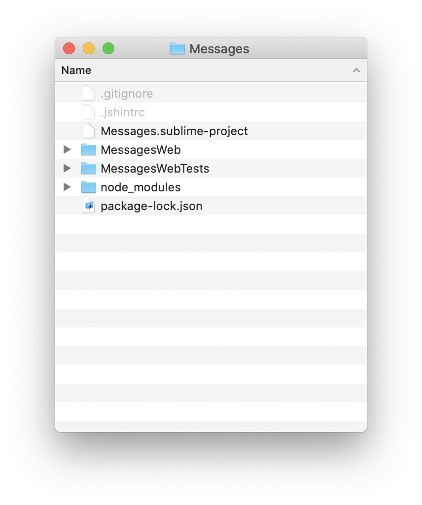
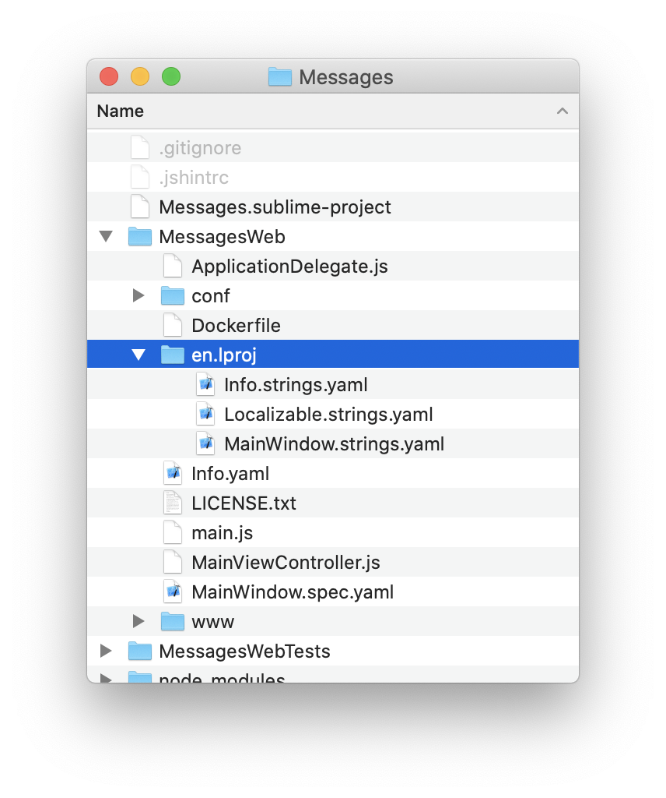
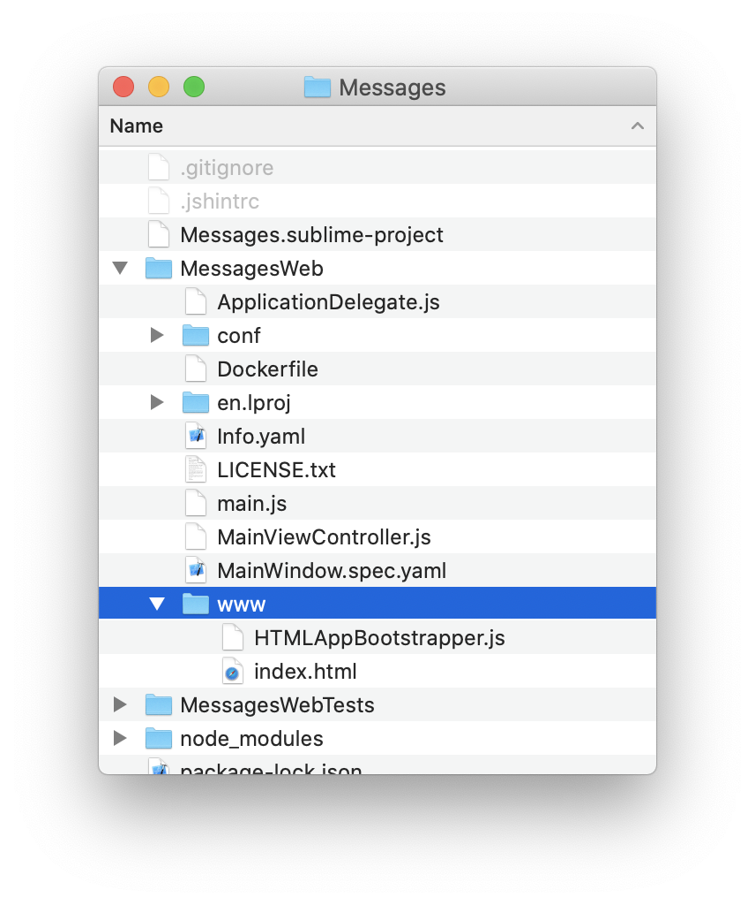

Creating a Web-based UIApplication
====

*Throughout this document, we'll use the example of a Messages application.*

Using the `jskit` command line utilty, a web-based application is created
with the `jskit add`(jskit.add) subcommand.

The first step is to create a workspace for your application's various
projects.  Even this simplest web application has two projects: the `UIKit` app
itself and a companion `TestKit` project.
````
$ cd ~/Documents
$ mkdir Messages
$ cd Messages
$ npm install jskit
$ npx jskit init
````

With the workspace initialized, you can add a project.  Note that
we're creating an `html`(jskit.add.html) project, which will result in a
web-based `UIKit` project:
````
$ npx jskit add html MessagesWeb
````

Workspace Organization
========

At this point, your workspace includes a few folders and files:



- `package-lock.json` and `node_modules/` are created by `npm install` and are
  related to how node.js manages intalled modules.
- `.gitignore` is created by `jskit init` with defaults for items that should
  be ignored by `git`
- `.jshintrc` is created by `jskit init` to include a list of globals that
  are availble to `JSKit` based projects
- `Messages.sublime-project` is created by `jskit init` to provide a project
  organization for the SublimeText editor
- `MessagesWeb/` is your `UIKit` based project
- `MessagesWebTests/` is your `TestKit` based project, automatically created by
  `jskit add`

The files you'll be most intersted in editing are inside the `MessagesWeb/`
and `MessagesWebTests/` folders, the two projects in the workspace.

Project Organization
===========

Each project created by `jskit add` comes from a template that includes
a few basic things to get the project going.

Taking a look inside the `MessagesWeb/` project, we see


- `Info.yaml` contains application properties that define how the app starts up
- `MainWindow.spec.yaml` is a spec file that sketches out the major UI elements
- `ApplicationDelegate.js` handles tasks when the application launches
- `MainViewController.js` is a controller for the main view
- `en.lproj` contains English strings
- `www` contains boostrap html code
- `conf` constains an `nginx` config file
- `Dockerfile` defines how to package the app
- `LICENSE` contains the license for your code

Info File
---------

The `Info.yaml` is a collection of properties:

````
JSBundleType:               html
JSBundleIdentifier:         com.yourcompany.MessagesWeb
JSBundleVersion:            1.0.0
UIMainSpec:                 MainWindow
UIApplicationTitle:         .applicationTitle
UIApplicationLaunchOptions:
  uistate: {kind: positional, default: null}
  others: {kind: unknown}
# UIApplicationSystemFont:    Roboto-Light
````

The details of the Info file are specifie elsewhere, but the important property
for our purposes here is the `UIMainSpec` property, which tells the application
to load a spec file named `MainWindow` on startup.

*Note: when referencing a spec file in an `Info` file, the `.spec.yaml` file
extensions are implied and therefore not included*

*It's also possible to create an application without a spec file, using the
`UIApplicationDelegate`(UIApplication Info.UIApplicationDelegate) property instead of `UIMainSpec`.  In this case, an
instance of the class specified in the `UIApplicationDelegate`(UIApplication Info.UIApplicationDelegate) property will
be created during application startup.*

Main Spec
---------

The `MainWindow.spec.yaml` file defines the initial UI elements and returns a
class that implements the `UIApplicationDelegate` protocol as its
`File's Owner`:

````
File's Owner: /AppDelegate

AppDelegate:
  class: ApplicationDelegate
  outlets:
    window: /MainWindow
    mainViewController: /MainViewController

DarkColor:
  class : JSColor
  rgba: 204,0,0

MainWindow:
  class: UIRootWindow
  contentViewController: /MainViewController

MainViewController:
  class: MainViewController
  view: /MainView

MainView:
  class: UIView
  backgroundColor: /DarkColor
  subviews:
    - /Label
    - /TestButton
  outlets:
    label: /Label
    testButton: /TestButton

Label:
  class: UILabel
  frame: 10,10,100,20
  text: .helloWorld
  font:
    size: detail
  textColor:
    rgba: 204,0,0

TestButton:
  class: UIButton
  frame: 10,40,100,23
  title: .testButton.title
  target: /MainViewController
  action: test
````


Details of spec file programming can be found elsewhere, but the important
part for our purposes is noticing how the spec returns an instance of
`ApplicationDelegate` via its `File's Owner` key.

*How does it do that?  `File's Owner` points to another spec propery called
`AppDelegate`, which in turn defines a object that is an instance of the
`ApplicationDelegate` class.*

Application Delegate
--------------------

`ApplicationDelegate.js` contains the code for a class that implements the
`UIApplicationDelegate` protocol:

````
// #import UIKit
/* global JSClass, JSObject */
'use strict';

JSClass("ApplicationDelegate", JSObject, {

    window: null,
    mainViewController: null,

    applicationDidFinishLaunching: function(application, launchOptions){
        this.window.makeKeyAndOrderFront();
    }

});
````

Every application requires a single delegate to take over after the
application's initialization code has run.

In this case, when the application notifies the delegate that it's finished
launching, the delgate simply makes the main window visible.

The delegate is where you can do other things upon app launch such as:
- Setup `JSUserDefaults`
- Make necessary persistent connections to services

Main View Controller
--------------------

The `MainWindow` spec includes an instruction to add a `MainViewController`
instance to the main window.

`MainViewController.js` is the code that defines the `MainViewController` class.
It is used to maniuplate the view elements as needed.

````
// #import UIKit
/* global JSClass, JSBundle, UIViewController, MainViewController */
'use strict';

JSClass("MainViewController", UIViewController, {

    label: null,
    testButton: null,

    viewDidLoad: function(){
        MainViewController.$super.viewDidLoad.call(this);
    },

    viewDidAppear: function(){
        MainViewController.$super.viewDidAppear.call(this);
    },

    test: function(){
        this.label.text = JSBundle.mainBundle.localizedString("testing");
    }

});
````

As a simple demo, the template project shows how to hook up a button to a
view controller action in a spec file, and here the view controller code
shows the `test()`() function that handles the button action by changing
the label's text to a localized string.

Localization with .lproj folders
---------

Designing an application with localization in mind from the start is ideal.

Even if you only provide a single language to begin with, having code that
can easly accomodate other languages saves major headaches down the road.

Every `UIKit` based app contains one or more `.lproj` folders.  By default,
an `en.lproj` folder is created as part of your project template.

Inside `en.lproj` are `.strings.yaml` files that define a mapping of keys to
values:



You'll notice that in `MainWindow.spec.yaml`, the `Label.text` property is
`.helloWorld`.  The leading `.` indicates that the actual string for the label
should be looked up in `en.lproj/MainWindow.strings.yaml` under the
`en.helloWorld` key (where `en` can change depending on the user's preferred
language).

`en.lproj/MainWindow.strings.yaml` looks like:

````
en:
  helloWorld: Hello, world!
  testButton:
    title: Test
````

Each file in `en.lproj` is considered a table.  `MainWindow.strings.yaml` is
the `MainWindow` table, which is the default place that `MainWindow.spec.yaml`
looks for localized strings (each spec looks for a string table with the same
name as the spec).

In code like you see in `MainViewController`, the `localizedString()` method
defaults to looking in a table called `Localizable`.

To add other lauguages, simply copy the `en.lproj` folder and update the
string tables.

For example, if you wanted to make a spanish translation availble, you'd
1. Copy `en.lproj` to `es.lproj` (`es` for Español).
2. Edit each string table file to start with a top level `es` key instead of
   `en`
3. Change the strings for each key to spanish.


Here's what `es.lproj/MainWindow.strings.yaml` would look like:
````
es:
  helloWorld: ¡Hola Mundo!
  testButton:
    title: Prueba
````

www, conf, and HTML Bootstrapping
------------
At this point, you may be wondering where the web-app features are.  All we've
discussed so far are concepts that have nothing to do with serving an HTML app
over HTTP.

Not having to interact much with the HTML and HTTP layers is by design.  In
fact, you could stop now and still have an app that works great because of the
default bootstrapping behavior.

The details of bootstrapping are defined elsewhere, but a few key concepts are
important:

- The application will be bundled into a single-page html app
- The html, javascript, images, fonts, and any other resources are considered
  100% static
- All of the application's resources will be cached by a service worker to allow
  offline functionality
- An nginx-based Docker image will be created for ease of deployment, but is
  not required for use

Inside the `www/` folder are two files:



- `index.html` is the single page that loads and runs the application
- `HTMLAppBootstrapper.js` is bootstrap code used by `index.html`

By default, `index.html` provides a generic splash screen with a loading
progress indicator.  The styling and messaging within `index.html` can be
completely customized by changing the HTML, CSS, and JavaScript within.

Note that `index.html` is actually a template that gets processed and adjusted
by the build system.  For example, the `title` element is filled in
automatically to match the value of `UIApplicationTitle` in the application's
`Info` file.

Everything inside the `www` folder will be bundled with the application in, but
`www` is treated special by the build system and its contents are not considered
application resources.

Images, Fonts, and Other Resources
=====
Easily referencing images, fonts, and other files from within an application's
code requires that those files be considered "resources" by the build sytem.

In a web app, pretty much anything that's not a `.js` file in the project folder
or subfolders (excluding the `www` and `conf` subfolders) is considered a
resource.

So, you can create whatever subfolder structure you want, putting code and
resources in any place, and the build system will find them.

*Note: resources are referenced by their filename regardless of which subfolder
they are in.  Therefore, you should avoid giving two resources the same filename
even if they are in different subfolders*

Resources are bundled in the application in a special way that includes their
metadata (like file sizes, mime types, and image resolutions).  In web apps,
the bundled resources are also given special filenames based on their content so
they can be cached forever, but always downloaded new when modified.